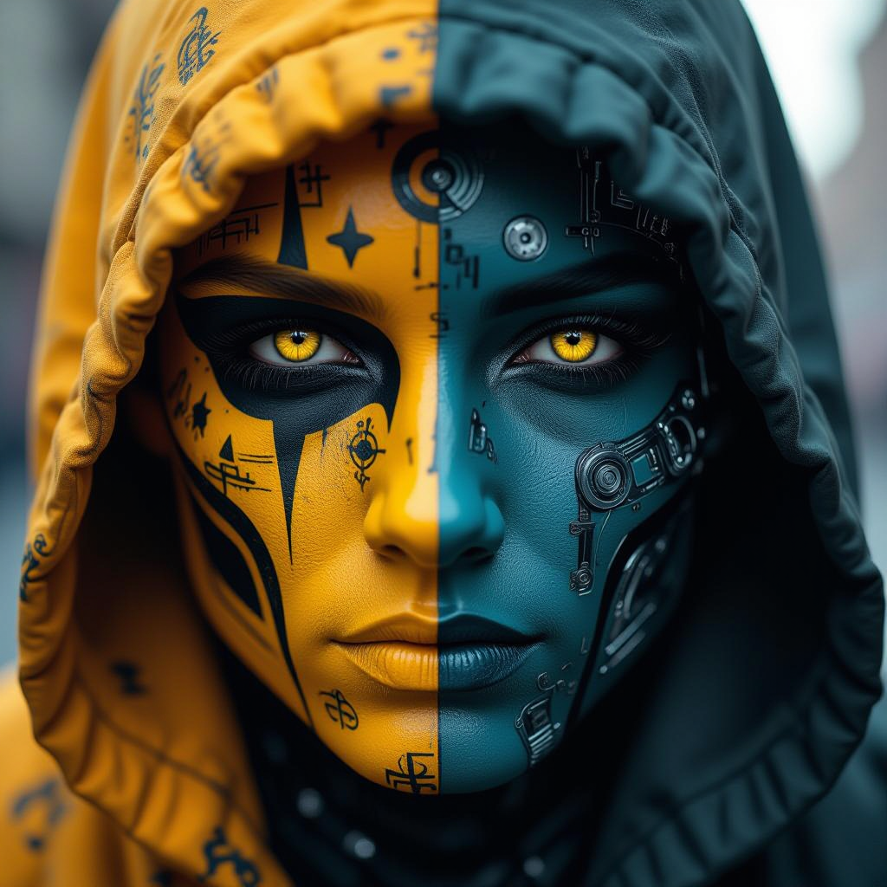

# ComfyUI Asset Downloader

A ComfyUI custom node that allows you to download models and other assets from external sources like Hugging Face and CivitAI directly within your workflows.

## Features

- Download models, checkpoints, VAEs, and other assets from external URLs
- Specify custom save locations within your ComfyUI models directory
- Support for authenticated downloads using API tokens
- Visual progress indicator during downloads
- Embed download nodes directly in your workflows to ensure dependencies are available

## Installation

```bash
cd ComfyUI/custom_nodes/
git clone https://github.com/ServiceStack/comfy-asset-downloader
cd comfy-asset-downloader
pip install -r requirements.txt
```

Restart ComfyUI after installation.

## Usage

The Asset Downloader node provides a simple interface:

- **url**: The direct URL to the file you want to download
- **save_to**: The subfolder within your ComfyUI models directory to save the file
- **filename**: The name to save the file as
- **token** (optional): API token for authenticated downloads (e.g. for CivitAI or private Hugging Face repositories)

For ease of use and security the **token** can be prefixed with `$` to use an environment variable (e.g. `$HF_TOKEN` or `$CIVITAI_TOKEN`) for the token available to the ComfyUI instance.

This will use the value of the `HF_TOKEN` environment variable if it exists.

### Usage

1. Add an `AssetDownloader` node to your workflow
2. Set the URL to a model file (e.g., `https://huggingface.co/model-repo/resolve/main/the_model.safetensors`)
3. Choose the appropriate save location (e.g. `checkpoints`)
4. Set the filename (e.g., `the_model.safetensors`)
5. Run the workflow - the file will be downloaded if it doesn't already exist

## Example Workflows

Check out the example workflows in the `examples` folder:



- `hidream-dev-face.json`: ComfyUI workflow that downloads and uses the leading OSS **HiDream-I1 Dev** model for high quality image generation.
- `hidream-fast-crystalball.json`: A workflow that downloads and uses the fast version of **HiDream-I1 Fast** model
- `flux1-schnell-cyborg.json`: A workflow using the **FLUX.1-schnell** model from Hugging Face (requires HF token)
- `epiCRealismXL-sparrow.json`: A workflow that downloads the [epiCRealism XL](https://civitai.com/models/277058?modelVersionId=1522905) model from CivitAI (requires CivitAI token) for realistic image generation.
- `dreamshaperXL-forest-woman.json`: A workflow using [DreamShaper XL](https://civitai.com/models/112902/dreamshaper-xl) from CivitAI
- `jibMixRealisticXL-hamster.json`: A workflow that uses [Jib Mix Realistic XL](https://civitai.com/models/194768/jib-mix-realistic-xl) from CivitAI
- `sdxl_lightning-enchantress.json`: A workflow that downloads **SDXL-Lightning** from Hugging Face for fast image generation using SDXL.
- `sd3.5_large_fp8-spider.json`: A workflow that downloads **Stable Diffusion 3.5 Large FP8** model from Hugging Face for a more resource efficient high quality SD 3.5 Large image generation
